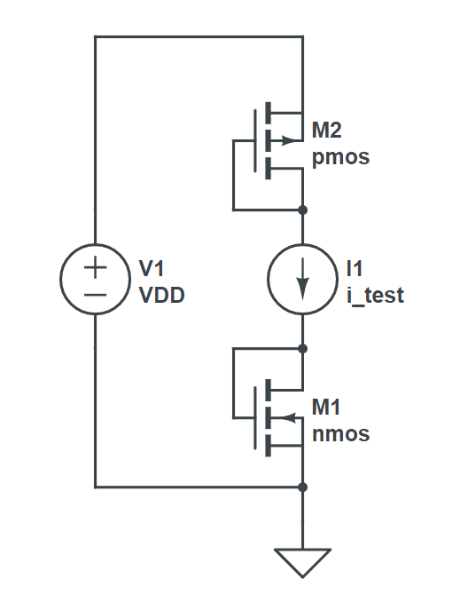

# Welcome to The Unviersity of Utah's C/Id methodology software suite
The **C/ID API** is a Python3 based software suite that aids analog integrated circuit (IC) designers in realizing their circuit designs in fast time scales with accurate scripting capabilities in a technology agnostic fashion. This API affords an IC designer to accurately model and create technology agnostic design scripts and equations to greatly reduce the amount of SPICE simulations conventionally needed in analog IC design and design migration.

The **C/Id** methodology is very similar to the **gm/Id** methodology but with a few key differences. One of the large differences is in characterizations of technologies. C/Id uses a current source based testbench with only one current source as opposed to voltage source based testbenches as in gm/Id for technology characterizations. Another large difference is in how lookup tables are stored. Since only one current source is needed to characterize a technology, this means that only a 1-D lookup table is needed as opposed to a 4-D lookup table as in gm/ID.

 **This API supports lookups for C/Id, gm/Id & Inversion Coefficent (IC)**

Both the C/Id and gm/Id methodologies use lookup tables to store characterization results and produce SPICE accurate lookups. C/Id also has the ability to do all lookups in the same fashion and function that gm/Id is capable of.

For now the C/Id software only supports Cadence/Spectre simulator for characterizations using the Spectre Measurement Description Language (MDL) for technology characterization.

# Installation
Installation procedures are found in the docs directory in the file installation_guide.pdf
# Technology Characterization
All FET technologies can be characterized with this testbench.

 The value of the ideal current source that connects the PFET and NFET drains together is swept and DC operating points for each device are saved and extracted with each DC operating point for lookup table generation. The Spectre MDL scripts provided in this repo create CSV files for lookup tables. The software takes care of translating the CSV files into the API. This characterization should be done for all lengths of transistor under interested or for a good span of lengths available in a given PDK. This charactetrization only needs to be done once per PDK.

 This testbench provides less complexity than the generally accepted gm/Id lookup table generation that use 3 voltage sources for both NFET and PFET devices.

# Getting Started

# API Design Example

# Files and Directories Description

